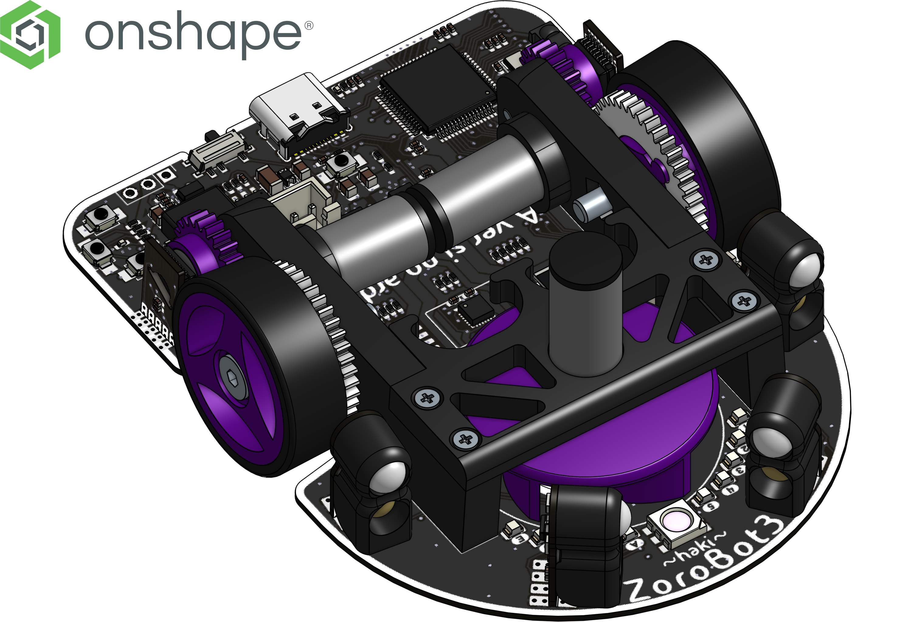

# ZoroBot3

El diseño de ZoroBot3 se encuentra disponible en [Onshape](https://cad.onshape.com/documents/c2349433f4c043eb0ce1efdc/w/394e4193cf2128d0e3f2c628/e/e80155225ff3f9b05f3c7000?renderMode=0&uiState=682c976b988bbc05ecb107cc), donde están diseñados todos los componentes del robot, incluyendo el chasis, la PCB y los engranajes. 
