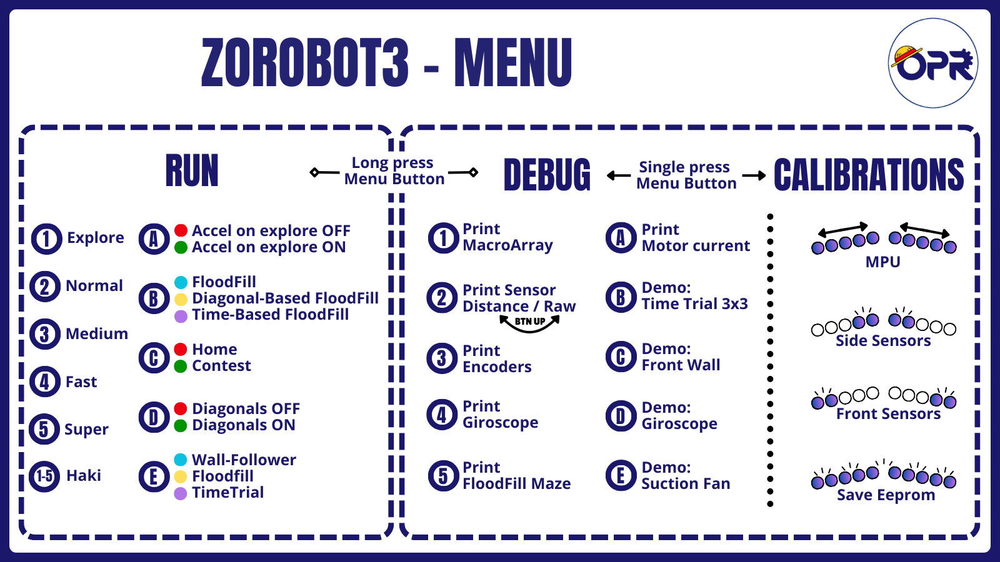

# Operativa General

## Tipos de Ejecución

- **EXPLORE**: Tapando el led frontal derecho:
- **EXPLORE & RUN**: Tapando el led frontal derecho y, posteriormente, el led frontal izquierdo.
- **RUN**: Tapando el led frontal izquierdo.

## Tipos de Mapeo

- **EXPLORE_SIMPLE**: Mapea hasta llegar por primera vez a **GOAL**.
- **EXPLORE_HOME**: Mapea hasta llegar por primera vez a **GOAL** y luego mapea volviendo a **HOME**.
- **EXPLORE_COMPLETE**: Mapea hasta que no queden casillas sin visitar para la solución más óptima del algoritmo de mapeo seleccionado.

## Condiciones de comportamiento

- **EXPLORE_SIMPLE** y **EXPLORE_COMPLETE** volverán a la casilla de **HOME** al finalizar el mapeo _solo si_ se trata de una ejecución **EXPLORE & RUN**. En caso contrario, el robot se detendrá en **GOAL** o en la última casilla necesaria para la ruta óptima.
- **EXPLORE_HOME** siempre vuelve hasta la casilla de **HOME** aunque ya haya visitado todo el camino correspondiente.
- Se puede modificar el tipo de mapeo después del primer **EXPLORE & RUN**, por ejemplo para completar el mapeo existente en búsqueda de la ruta más óptima para un **RUN** posterior. (ver advertencias importantes)
- Al terminar cada acción de **RUN** el robot se detendrá en la casilla de **GOAL** esperando a ser recogido.

## Advertencias importantes

- **Se requiere reiniciar el robot** después de la ejecución de cada tipo de inicio (**EXPLORE**, **EXPLORE & RUN**, **RUN**).
- Si se pretende hacer un **EXPLORE_COMPLETE** como refinamiento de un mapeo anterior y se ha reiniciado el robot, **es necesario pulsar el botón de menú** una vez el robot esté en modo iniciando (con el RGB en rojo esperando orden de arrancar) para que el led rojo de menú se apague y **no se borre todo el mapeo anterior**.

