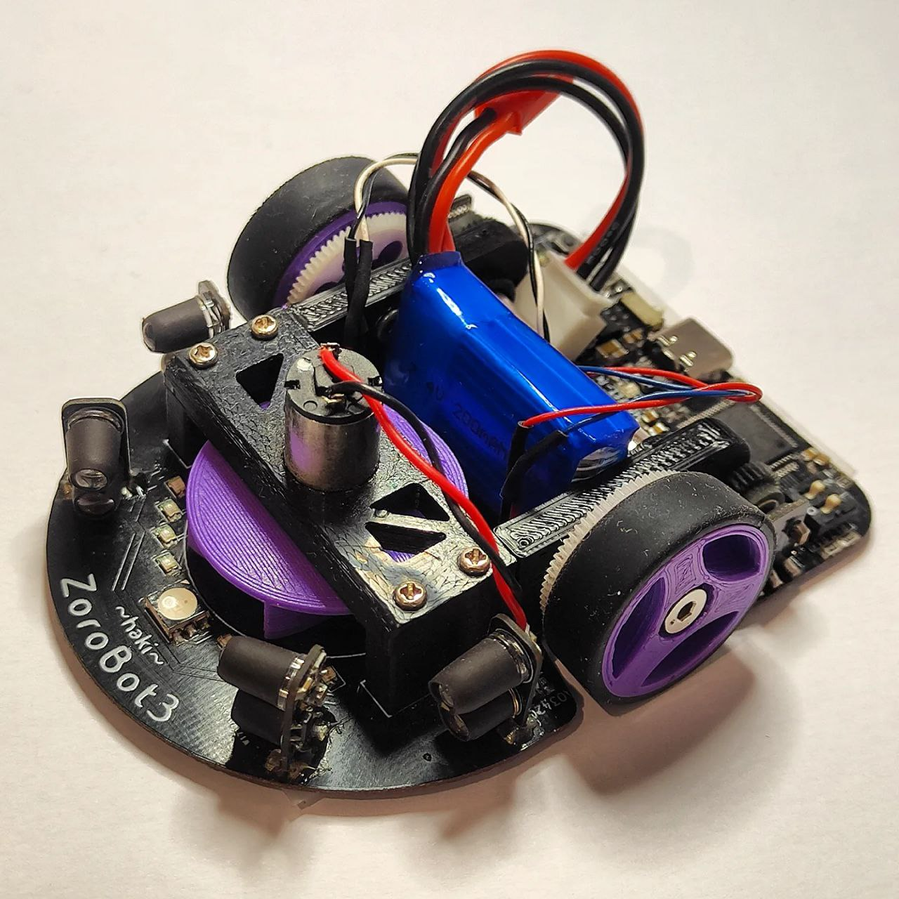
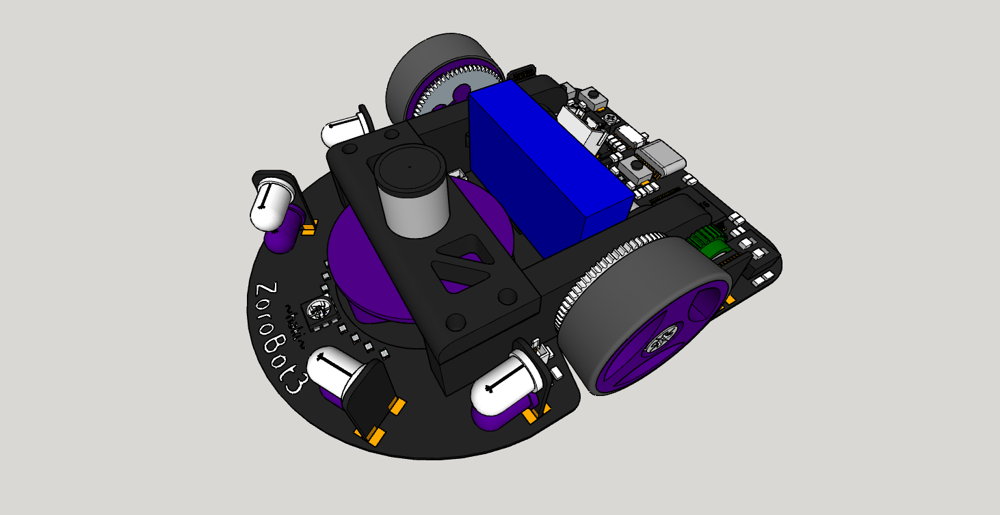
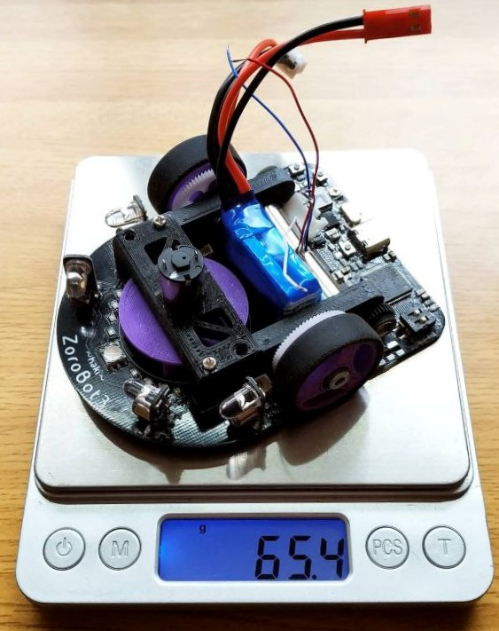

# ZoroBot3
Tercera versión de nuestro primer robot. Un robot micromouse de alto rendimiento con STM32F4, encoders magneticos de alta resolución, succión y muchos leds molones.

## Hardware
- STM32F405RGT6
- Driver de motores TB6612FNG
- 2x Motores coreless 2010 7.4v aliexpress
- DIP Switch 3p SMD
- LiPo 2S ~190 mAh
- 4x Pares emisor receptor IR
- Goma de ruedas Atomic AR001 de 1/28 RC
- Chasis de PCB con soportes de motores y ventilador en PLA

## Software
- Programado con VSCode y PlatformIO con LibOpenCM3
- Disponibles programas básicos de seguir pared derecha/izquierda

