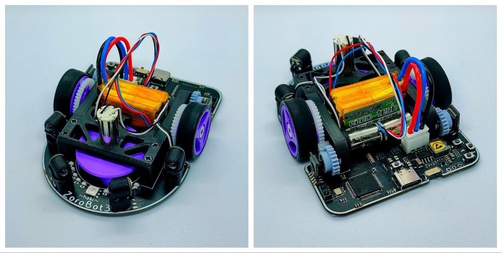
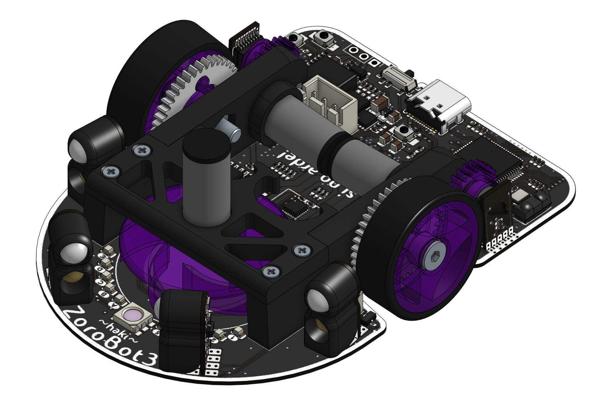

# ZoroBot3

Tercera versión de nuestro primer robot. Un robot micromouse de alto rendimiento con STM32F4, encoders magneticos de alta resolución, succión y muchos leds molones.

## 🏆 Palmarés

<table style="width:50%; border-collapse: collapse; margin-left:auto; margin-right:auto;">
  <tr>
    <th style="text-align:center; font-size:1.2em;">🥇</th>
    <th style="text-align:center; font-size:1.2em;">🥈</th>
    <th style="text-align:center; font-size:1.2em;">🥉</th>
  </tr>
  <tr>
    <td style="text-align:center; font-size:1.5em; font-weight:bold;">7</td>
    <td style="text-align:center; font-size:1.5em; font-weight:bold;">0</td>
    <td style="text-align:center; font-size:1.5em; font-weight:bold;">0</td>
  </tr>
</table>

### Resultados por Evento

<table style="width:100%; border-collapse: collapse;">
  <tr>
    <th>Evento</th>
    <th>Categoría</th>
    <th style="text-align:center;">Posición</th>
    <th style="text-align:center;">Año</th>
  </tr>
  <tr>
    <td> <strong>RoboChallenge</strong></td>
    <td>Maze</td>
    <td style="text-align:center;">🥇</td>
    <td style="text-align:center;">2025</td>
  </tr>
  <tr>
    <td> <strong>OSHWDem</strong></td>
    <td>Micromouse Classic</td>
    <td style="text-align:center;">🥇</td>
    <td style="text-align:center;">2025</td>
  </tr>
  <tr>
    <td> <strong>Micromouse Portugese Contest</strong></td>
    <td>Micromouse Classic</td>
    <td style="text-align:center;">🥇</td>
    <td style="text-align:center;">2025</td>
  </tr>
  <tr>
    <td> <strong>Micromouse Portugese Contest</strong></td>
    <td>Time Trial</td>
    <td style="text-align:center;">🥇</td>
    <td style="text-align:center;">2025</td>
  </tr>
  <tr>
    <td> <strong>RoboChallenge</strong></td>
    <td>Maze</td>
    <td style="text-align:center;">🥇</td>
    <td style="text-align:center;">2024</td>
  </tr>
  <tr>
    <td> <strong>OSHWDem</strong></td>
    <td>Micromouse Classic</td>
    <td style="text-align:center;">🥇</td>
    <td style="text-align:center;">2024</td>
  </tr>
  <tr>
    <td> <strong>OSHWDem</strong></td>
    <td>Micromouse Wall-Follower</td>
    <td style="text-align:center;">🥇</td>
    <td style="text-align:center;">2023</td>
  </tr>
</table>

---

## ⚙️ Hardware

- **Microcontrolador**: STM32F405RGT6 @168MHz
- **Driver de motores**: MP6551 @20kHz
- **Giroscopio**: LSM6DSRTR 4000dps
- **Encoders**: AS5145B-HSST
- **Mosfets**: AO3400 (A09T) Tanto para conmutar los emisores de los sensores como para la succión
- **Regulador**: CN3903 + LDO ME611C33M5G
- **Receptor IR 38kHz**: TSSP77038TR
- **Bateria**: LiPo 2S 260mAh 35-70C Turnigy nano-tech
- **Sensores**:
  - 4 Emisores IR SFH-4550
  - 4 Receptores IR ST-1KL3A
- **Tracción**:
  - 2x Motores Coreless 8520 7.4v genéricos (AliExpress)
  - Goma de ruedas Kyosho K.MZW39-30
  - Chasis de PCB con soportes de motores y ventilador en PLA
  - Piñones de motores 8T 0.5M
  - Engranajes de las ruedas 40T 0.5M
  - Engranajes de los encoders 22T 0.5M impresos en resina
  - 4x Rodamientos MR63ZZ (Ruedas)
  - 2x Rodamientos MR52ZZ (Encoders)
  - 2x Imán radial 6x2.5mm

## 💻 Software

- Programado en VSCode y PlatformIO con LibOpenCM3.
- Todos los valores analógicos se leen mediante **DMA** y son procesados cada 1ms.
- Los sensores se leen mediante una máquina de estados a 16kHz, enciendiendo y apagando los emisores para **filtrar la luz ambiente**.
- El valor de los encoders se lee en **cuadratura por hardware** mediante dos timers.
- El MPU se lee mediante SPI.
- El bucle principal de control, del que constan los PID de velocidad lineal, velocidad angular, control frontal y control lateral se ejecuta cada 1ms.
- Se realiza un reseteo de posición por périda de pared lateral para mejorar la navegación.
- Las curvas se realizan mediante perfiles de giro con **aceleración senoidal** para mayor suavidad.
- Dispone de programas para seguimiento de pared derecha/izquierda, exploración y resolución mediante floodfill basado en pesos (más información en [TimeBased FloodFill Simulator](https://github.com/OPRobots/TimeBased-FloodFill-Simulator)) y hardcodeo de movimientos.

## 🎥 Vídeos

### OSHWDem 2025 - 🥇

<video src="https://github.com/user-attachments/assets/332fd117-6600-4692-b59f-4b1154166f3f" width="80%" controls></video>

### Micromouse Portugese Contest 2025 - 🥇

<video src="https://github.com/user-attachments/assets/cf21e942-3fe0-4065-8892-fa3d181a9791" width="80%" controls></video>

### RoboChallenge 2024 - 🥇

<video src="https://github.com/user-attachments/assets/a8c53e97-a756-4934-9c83-6c93fda1b235" width="80%" controls></video>

### OSHWDem 2024 - 🥇

<video src="https://github.com/user-attachments/assets/a70629e6-34b6-473f-afb0-14d8290bd128" width="80%" controls></video>

