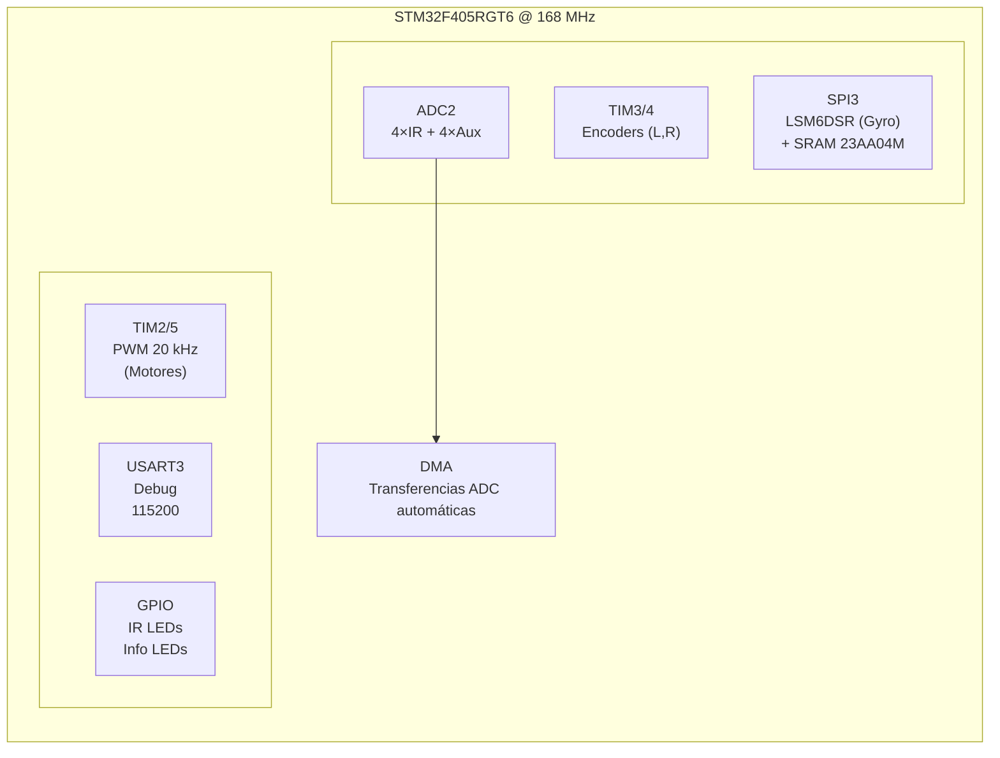

# Hardware

## Microcontrolador

| Característica | Detalle |
|---------------|---------|
| **Modelo** | STM32F405RGT6 |
| **Arquitectura** | ARM Cortex-M4F (FPU) |
| **Frecuencia** | 168 MHz |
| **Flash** | 1 MB |
| **RAM** | 192 KB |
| **Framework** | LibOpenCM3 |
| **Entorno** | PlatformIO + VSCode |

El STM32F405RGT6 proporciona:
- **Timers**: TIM3 y TIM4 para lectura de encoders en modo contador. TIM2 y TIM5 generan PWM para motores (20 kHz).
- **ADC**: ADC2 para lectura de 4 sensores IR + 4 canales auxiliares (batería, corriente motores, botón menú).
- **SPI**: SPI3 compartido entre el giroscopio LSM6DSR (CS PA15), el MPU-6500 de placa (U1, CS PA15) y la SRAM externa 23AA04M (CS PB12).
- **USART**: USART3 para printf por puerto serie (115200 baud).
- **DMA**: Usado para lecturas ADC.
- **GPIO**: Control de emisores IR, LEDs, habilitación de motores, chip select SPI.

---

## Sensores Infrarrojos

### Componentes

| Componente | Modelo | Cantidad |
|-----------|--------|----------|
| **Emisor IR** | SFH-4550 (GaAs, 860 nm, alta eficiencia) | 4 |
| **Receptor IR** | ST-1KL3A (fototransistor, encapsulado negro) | 4 |

### Disposición

| Sensor | ID | Canal ADC | GPIO Emitter | Función |
|--------|----|-----------|-------------|---------|
| Front Left | `SENSOR_FRONT_LEFT_WALL_ID` (0) | ADC_CHANNEL10 (PC0) | PA0 | Pared frontal izquierda |
| Front Right | `SENSOR_FRONT_RIGHT_WALL_ID` (1) | ADC_CHANNEL13 (PC3) | PA3 | Pared frontal derecha |
| Side Left | `SENSOR_SIDE_LEFT_WALL_ID` (2) | ADC_CHANNEL12 (PC2) | PA2 | Pared lateral izquierda |
| Side Right | `SENSOR_SIDE_RIGHT_WALL_ID` (3) | ADC_CHANNEL11 (PC1) | PA1 | Pared lateral derecha |

### Principio de Funcionamiento

1. **Medición diferencial**: Se mide `sensors_off` (LED apagado, luz ambiental) y `sensors_on` (LED encendido). La señal útil = `on - off`.
2. **Ley física**: La relación entre distancia y lectura sigue aproximadamente `reading ≈ k / distance²`.
3. **Secuencia**: Solo se enciende un LED a la vez para evitar crosstalk óptico.

---

## Encoders Magnéticos

| Característica | Detalle |
|---------------|---------|
| **Modelo** | AS5145B-HSST |
| **Resolución** | 12 bits (4096 posiciones/revolución) |
| **Interfaz** | Timer en modo contador (cuadratura por hardware) |
| **Timer izquierda** | TIM4 |
| **Timer derecha** | TIM3 |
| **Micrómetros por tick** | 10.494055 μm |

Conversión: `μm = ticks × 10.494055`. Derivado de `(π × diámetro_rueda) / 4096`.

**Relación de engranajes**:
- Piñón motor: 8T 0.5M
- Engranaje rueda: 40T 0.5M
- Engranaje encoder: 22T 0.5M (resina)

---

## Giroscopio

| Característica | Detalle |
|---------------|---------|
| **Modelo** | LSM6DSRTR |
| **Interfaz** | SPI3 (PA15 = CS) |
| **Rangos** | 1000 / 2000 / 4000 dps |
| **ODR** | 1666 Hz |
| **Filtro** | Paso-bajo LIGHT (~100 Hz en 1000 dps) |
| **Block Data Update** | Habilitado |

El full-scale se cambia dinámicamente según la estrategia de velocidad (1000 dps en exploración, 2000 dps en carrera).

---

## SRAM Externa

| Característica | Detalle |
|---------------|---------|
| **Modelo** | 23AA04M-I/ST (Microchip, TSSOP-8) |
| **Capacidad** | 4 Mbit (512 KiB) |
| **Interfaz** | SPI3 (bus compartido con el giroscopio) |
| **CS** | PB12 (net `NSS_SRAM`, pull-up 10 kΩ) |
| **Componentes auxiliares** | RRAM1 (10 kΩ pull-up) y CSRAM1 (100 nF decoupling) |

> ⚠️ La SRAM está añadida en el esquemático pero aún no está colocada en la PCB ni
> tiene driver en el firmware (ver [HW-01](17-known-issues.md#hw-01) y
> [HW-05](17-known-issues.md#hw-05)).

---

## Motores y Tracción

| Componente | Detalle |
|-----------|---------|
| **Motores** | 2× Coreless 8520 7.4V (genéricos) |
| **Driver** | MP6551 @ 20 kHz PWM |
| **Ruedas** | Goma Kyosho K.MZW39-30 |
| **Rodamientos ruedas** | 4× MR63ZZ |
| **Rodamientos encoders** | 2× MR52ZZ |
| **Imán encoders** | 2× Radial 6×2.5mm |
| **Ventilador** | Succión controlada por MOSFET NMOS (Q1) con PWM |

### PWM y control
- Resolución PWM: 1024 niveles (10 bits)
- Frecuencia PWM motores: 20 kHz
- MOSFET AON7423 (Q2, canal P) en la entrada de batería; emisores IR conmutados por GPIO y ventilador por Q1 (NMOS)

---

## Alimentación

| Componente | Detalle |
|-----------|---------|
| **Batería** | LiPo 2S 260mAh 35-70C Turnigy nano-tech |
| **Regulador principal** | CN3903 (buck DC-DC) |
| **LDO** | ME611C33M5G (3.3V para MCU y sensores) |
| **Rango 2S** | 7.4V (bajo) - 8.4V (alto) |
| **Soporte 3S** | 11.0V - 12.6V (requiere cambiar `VOLT_DIV_FACTOR`) |

---

## Chasis y PCB

- **Chasis**: PCB principal con soportes de motores y ventilador en PLA
- **Diseño PCB**: KiCad (archivos en `pcb_files/`)
- **Piezas impresas**: 11 archivos STL (soportes, engranajes, ruedas, ventilador)

---

## Versiones del Robot

Existen 3 versiones del robot identificadas por el STM32 UID (Unique ID):

| Versión | Enum | Identificación |
|---------|------|---------------|
| ZOROBOT3_A | 1 | Primera revisión |
| ZOROBOT3_B | 2 | Segunda revisión |
| ZOROBOT3_C | 3 | Tercera revisión |

Cada versión tiene diferentes parámetros de calibración ABC para los sensores (ver [Sensores](03-sensors.md#parametros-abc-por-version-del-robot)).

La detección se realiza en `handle_robot_version()` leyendo `UID_WORD0` del registro `0x1FFF7A10`.

---

## Pinout y Periféricos

### ADC2 (Sensores + Auxiliares)
| Canal | GPIO | Función |
|-------|------|---------|
| CH10 | PC0 | Sensor Front Left |
| CH13 | PC3 | Sensor Front Right |
| CH12 | PC2 | Sensor Side Left |
| CH11 | PC1 | Sensor Side Right |
| CH4 | PA4 | Batería (AUX_BATTERY_ID) |
| CH14 | PC4 | Corriente motor izquierdo (sin amplificador front-end — ver [HW-02](17-known-issues.md#hw-02)) |
| CH15 | PC5 | Corriente motor derecho (sin amplificador front-end — ver [HW-02](17-known-issues.md#hw-02)) |
| CH8 | PB0 | Botón de menú (AUX_MENU_BTN_ID) |

### SPI3 (Giroscopio + SRAM)
| GPIO | Función |
|------|---------|
| PA15 | CS giroscopio (LSM6DSR vía conector DATA_MPU1; MPU-6500 U1 comparte bus y CS) |
| PB12 | CS SRAM (NSS_SRAM, pull-up 10 kΩ) |
| PC10 | SCK |
| PC11 | MISO |
| PC12 | MOSI |

### USART3 (Debug)
| GPIO | Función |
|------|---------|
| PC6 | TX |
| PC7 | RX |

### GPIO Control
| GPIO | Función |
|------|---------|
| PA0-PA3 | Emisores IR (LED ON/OFF) |
| PB13 | LED de estado |
| PB14 | LED RGB (TIM12, CH1-3) |
| PA6-PA7, PC8-PC9, PB1-PB2, PA11-PA12, PB8-PB9 | LEDs de información (10) |
| PB6-PB7 | Botones de menú |
| PB15 | Driver motores enable |
| PB10 | Ventilador (PWM) |

### Receptor IR
| Componente | Detalle |
|-----------|---------|
| **Modelo** | TSSP77038TR |
| **Frecuencia** | 38 kHz |
| **Protocolo** | RC5 |

---

## Esquema de Bloques

---

*Documento generado el 2026-08-25. Referencia cruzada con [Sensores](03-sensors.md), [Encoders y Giroscopio](12-encoders-gyro.md), [Problemas Conocidos](17-known-issues.md).*
