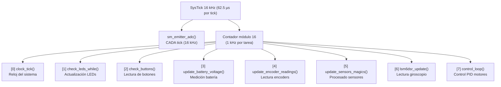
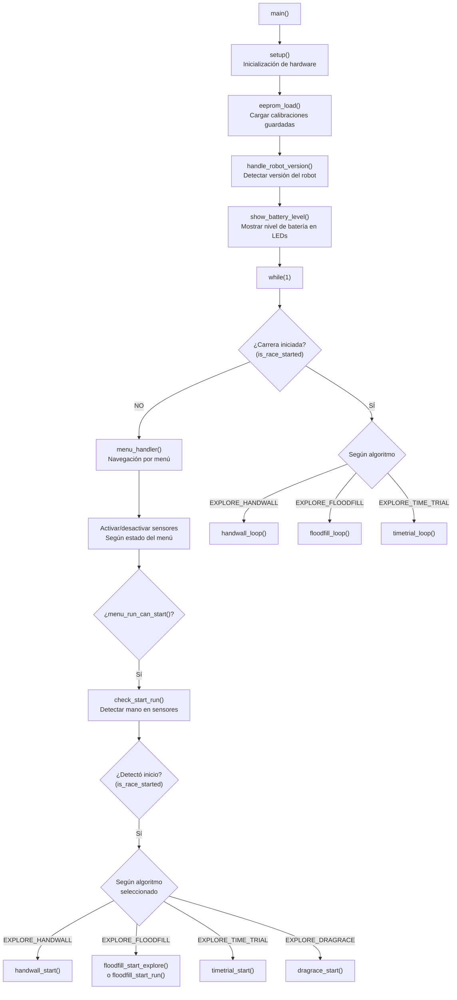
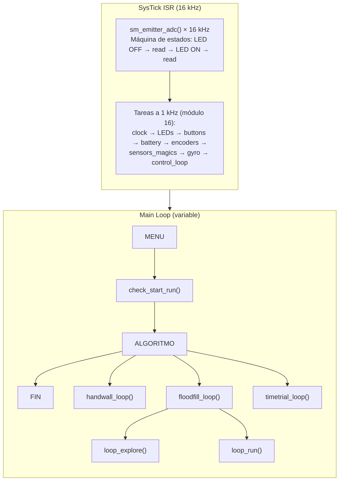

# Arquitectura Software


## Visión General

ZoroBot3 utiliza una arquitectura de **dos niveles**:

| Nivel | Contexto | Frecuencia | Responsabilidad |
|-------|----------|------------|-----------------|
| **ISR (SysTick)** | Interrupción | 16 kHz | Control en tiempo real |
| **Main Loop** | Bucle principal | Variable | Máquinas de estado de alto nivel |

El ISR ejecuta el control motor y lectura de sensores de forma determinista. El bucle principal ejecuta funciones bloqueantes de alto nivel (movimientos, navegación) mientras el ISR mantiene el control en segundo plano.

---

## SysTick ISR

Archivo: [`source_code/src/main.c:23-58`](../source_code/src/main.c#L23-L58)

```c
void sys_tick_handler(void) {
    static uint8_t tick_count = 0;

    sm_emitter_adc();  // 16 kHz — siempre

    switch (tick_count) {
        case 0: clock_tick(); break;              // 1 kHz
        case 1: check_leds_while(); break;        // 1 kHz
        case 2: check_buttons(); break;           // 1 kHz
        case 3: update_battery_voltage(); break;  // 1 kHz
        case 4: update_encoder_readings(); break; // 1 kHz
        case 5: update_sensors_magics(); break;   // 1 kHz
        case 6: lsm6dsr_update(); break;          // 1 kHz
        case 7: control_loop(); break;            // 1 kHz
    }

    tick_count = (tick_count + 1) % 16;
}
```

### Distribución Temporal



> **Nota**: La frecuencia efectiva de 1 kHz por tarea depende de que SysTick sea exactamente 16 kHz. Si el prescaler no coincide, todas las frecuencias derivadas serán incorrectas. Ver [issue MV-18](15-known-issues.md#mv-18).

---

## Bucle Principal

Archivo: [`source_code/src/main.c:60-205`](../source_code/src/main.c#L60-L205)



### Modelo de Ejecución

El bucle principal llama a funciones **bloqueantes** para movimientos como `move_straight()`. Mientras estas funciones esperan (bucle `while` comprobando distancia recorrida), el **ISR SysTick** ejecuta el control PID en segundo plano, actualizando los PWM de los motores en tiempo real.

Esto crea un modelo de ejecución cooperativo donde:
- El **main loop** decide QUÉ hacer (high-level planning)
- El **ISR** decide CÓMO hacerlo (low-level control)

---

## Inicio de Competición

### `check_start_run()` ([`control.c:167-219`](../source_code/src/control.c#L167-L219))

El robot detecta automáticamente el inicio de competición mediante los sensores frontales:

1. Si cualquier sensor frontal detecta distancia ≤ `SENSOR_FRONT_DETECTION_START` (100 mm), se inicia un temporizador.
2. Si la detección persiste ≥ `SENSOR_START_MIN_MS` (350 ms), se arranca la carrera.
3. **Ventana de auto-run**: 2 segundos para que el segundo sensor detecte (modo auto-run). Si el sensor opuesto también detecta, se activa `race_auto_run`.

- **Sensor izquierdo (FL) activado** → El robot usa la mano izquierda o empieza floodfill en modo run.
- **Sensor derecho (FR) activado** → El robot usa la mano derecha o empieza floodfill en modo explore.

Para `EXPLORE_DRAGRACE`, no se usa `check_start_run()` — la carrera arranca directamente al pulsar start.

---

## Algoritmos de Exploración

Seleccionables desde el menú (ver [Menú](07-menu-system.md)):

### EXPLORE_HANDWALL (0)
- **Wall follower**: El robot sigue la pared con la mano izquierda o derecha.
- Detecta qué mano usar según el sensor frontal que se active primero.
- Simple y robusto para laberintos sin islas.
- Archivos: [`handwall.c`](../source_code/src/handwall.c), [`handwall.h`](../source_code/include/handwall.h)

### EXPLORE_FLOODFILL (2)
- **Navegación inteligente**: Usa el algoritmo floodfill para encontrar el camino óptimo.
- Explora celdas no visitadas, construye el mapa, y ejecuta speed run.
- Soporta 3 modos de exploración: `EXPLORE_SIMPLE`, `EXPLORE_HOME`, `EXPLORE_COMPLETE`.
- Archivos: [`floodfill.c`](../source_code/src/floodfill.c), [`floodfill.h`](../source_code/include/floodfill.h)

### EXPLORE_TIME_TRIAL (1)
- **Time trial**: Speed run en una pista predefinida (no maze).
- Ejecuta una secuencia de movimientos cronometrada.
- Archivos: [`timetrial.c`](../source_code/src/timetrial.c), [`timetrial.h`](../source_code/include/timetrial.h)

### EXPLORE_DRAGRACE (3)
- **Drag race**: Aceleración máxima en línea recta.
- Sin navegación — solo velocidad punta.
- Archivos: [`dragrace.c`](../source_code/src/dragrace.c), [`dragrace.h`](../source_code/include/dragrace.h)

---

## Modo Carrera (Speed Run)

Cuando el floodfill ha explorado el laberinto, se activa el modo carrera (`race_mode = true`):

1. `build_run_sequence()` — Genera la secuencia óptima de movimientos.
2. `smooth_run_sequence()` — Convierte la secuencia en movimientos físicos con optimización de diagonales.
3. `move_run_sequence()` — Ejecuta los movimientos a máxima velocidad con cinemática configurada.

La velocidad de carrera se configura desde el menú (SPEED_EXPLORE a SPEED_HAKI).

---

## Compilación Condicional

### `USE_RAW_SENSORS` ([`config.h:55`](../source_code/include/config.h#L55))

```c
#define USE_RAW_SENSORS true
```

Controla el modo de detección de paredes:
- **true**: Usa valores ADC raw (más estable, menos sensible a ruido de linealización)
- **false**: Usa distancia en mm (más intuitivo, unidades físicas)

### `MMSIM_ENABLED`

Cuando se compila para el simulador:
- Las lecturas de sensores se reemplazan por `API_wallFront()`, `API_wallLeft()`, `API_wallRight()`
- No hay hardware real (ADC, SPI, GPIO)
- Ver [Simulador](13-simulator.md)

### `CONFIG_RUN_RACE` / `CONFIG_RUN_DEBUG` ([`config.h:71-72`](../source_code/include/config.h#L71-L72))

Controla el modo de ejecución por defecto (RACE o DEBUG).

---

## Diagrama de Flujo General



---

*Documento generado el 2026-06-12. Referencias: [Control PID](06-control-system.md), [Menú](07-menu-system.md), [Floodfill](05-floodfill.md).*
