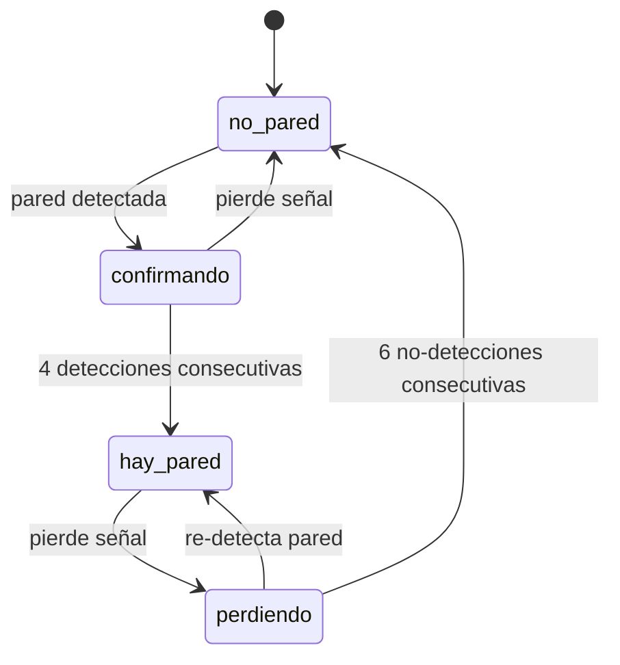
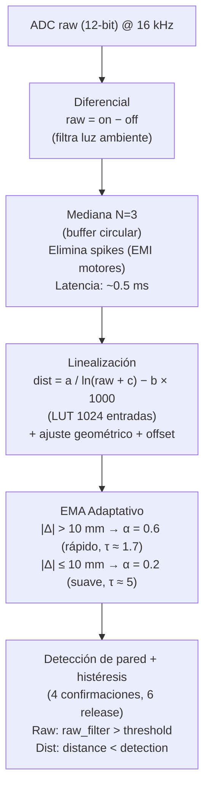

# Sistema de Sensores


## Hardware

4 sensores infrarrojos con lectura diferencial para filtrar luz ambiente:

| Sensor | ID | Canal ADC | GPIO Emitter | Función |
|--------|----|-----------|-------------|---------|
| Front Left | `SENSOR_FRONT_LEFT_WALL_ID` (0) | ADC_CHANNEL10 (PC0) | PA0 | Pared frontal (izquierda) |
| Front Right | `SENSOR_FRONT_RIGHT_WALL_ID` (1) | ADC_CHANNEL13 (PC3) | PA3 | Pared frontal (derecha) |
| Side Left | `SENSOR_SIDE_LEFT_WALL_ID` (2) | ADC_CHANNEL12 (PC2) | PA2 | Pared lateral izquierda |
| Side Right | `SENSOR_SIDE_RIGHT_WALL_ID` (3) | ADC_CHANNEL11 (PC1) | PA1 | Pared lateral derecha |

- **Emisor**: SFH-4550 (GaAs, 860 nm)
- **Receptor**: ST-1KL3A (fototransistor, filtro luz visible)
- **Principio**: `lectura útil = sensors_on − sensors_off` (filtrado de luz ambiental)
- **Ley física**: `reading ≈ k / distance²`

### Canales ADC Auxiliares

| Canal | GPIO | Función |
|-------|------|---------|
| ADC_CHANNEL4 | PA4 | Voltaje de batería |
| ADC_CHANNEL14 | PC4 | Corriente motor izquierdo |
| ADC_CHANNEL15 | PC5 | Corriente motor derecho |
| ADC_CHANNEL8 | PB0 | Botón de menú |

---

## Arquitectura Software

Archivos: [`sensors.h`](../source_code/include/sensors.h), [`sensors.c`](../source_code/src/sensors.c)

### Estados

```c
static bool sensors_enabled = false;        // Sensores activados
static bool sensors_taking_values = false;  // Toma de valores puntual (debug)
```

### Datos por sensor

| Variable | Descripción |
|----------|-------------|
| `sensors_raw[4]` | Valor crudo filtrado (on − off) |
| `sensors_on[4]` | Lectura ADC con LED encendido |
| `sensors_off[4]` | Lectura ADC con LED apagado |
| `sensors_distance[4]` | Distancia linealizada en mm |
| `sensors_distance_offset[4]` | Offset de calibración |
| `sensors_raw_wall_detection_threshold[4]` | Umbral raw para detección |
| `sensors_middle_target_distance[4]` | Distancia objetivo centro celda |

---

## Máquina de Estados ADC

`sm_emitter_adc()` ([`sensors.c:214-251`](../source_code/src/sensors.c#L214-L251)) ejecuta una máquina de 4 estados por sensor, llamada a 16 kHz:

```
Estado 1: Leer ADC (LED OFF) → Encender LED → Estado 2
Estado 2: Iniciar conversión ADC → Estado 3
Estado 3: Leer ADC (LED ON) → Apagar LED → Estado 4
Estado 4: Iniciar conversión ADC → Siguiente sensor → Estado 1
```

**Secuencia completa** (8 pasos por ciclo de 4 sensores):
```
FL_off → FL_on → FR_off → FR_on → SL_off → SL_on → SR_off → SR_on → FL_off...
```

### Timing

- Clock ADC2: ~42 MHz (PCLK2/2)
- Tiempo de conversión 12-bit: ~0.64 µs (15 ciclos sample + 12 ciclos conv)
- Intervalo entre estados (16 kHz): 62.5 µs
- **Margen de seguridad: ~97x** → no hay riesgo de solapamiento de conversiones.

---

## Linealización y Conversión a Distancia

### Proceso (`update_sensors_magics()`, [`sensors.c:462-525`](../source_code/src/sensors.c#L462-L525))

1. **Señal diferencial**: `raw = sensors_on − sensors_off`. Si `on ≤ off` → se descarta.

2. **Mediana de 3 muestras** (filtro anti-spike): `raw_filter = triplet_median(raw_ring[sensor][0], raw_ring[sensor][1], raw_ring[sensor][2])`. Elimina spikes de EMI de motores.

3. **Índice logarítmico**: `ln_index = (raw_filter + c) / 4`
   - Parámetro `c` específico por sensor y versión. **Clampeado a [0, 1023]** para evitar OOB.
   - Paso de 4 porque la LUT tiene resolución `ADC_RESOLUTION / 4 = 1024` entradas.

4. **Logaritmo natural**: `ln = get_ln_value(ln_index)` — tabla precalculada de 1024 entradas.
   - `ln(0)` se define como `1.0` para evitar inestabilidades numéricas.

5. **Fórmula de distancia**: `dist_raw = (a / ln − b) × 1000.0`
   - Parámetros `a`, `b` son coeficientes de calibración por sensor/versión.
   - Resultado en **micrómetros** (×1000).

6. **Ajuste geométrico**: Se suma la distancia del sensor al centro del robot:
   - Frontales: `+ROBOT_FRONT_LENGTH` (48.121 mm → 48121 μm)
   - Laterales: `+ROBOT_MIDDLE_WIDTH` (35.1 mm → 35100 μm)

7. **Offset de calibración**: `+sensors_distance_offset[sensor]`.

8. **Filtro EMA adaptativo**:
   - `|delta| > 10 mm` → α = 0.6 (respuesta rápida, τ ≈ 1.7 muestras)
   - `|delta| ≤ 10 mm` → α = 0.2 (filtrado agresivo, τ ≈ 5 muestras)

---

## Detección de Paredes

### Modo Raw (`USE_RAW_SENSORS = true`)

```c
wall_detected = raw_filter > raw_threshold
```

Umbral calculado con ley física 1/d²: `threshold = raw_at_cal / (1.5)² = raw_at_cal / 2.25`.

Esto fija la distancia de detección al 150% de la distancia de calibración:
- Frontales: `d_det = 174 × 1.5 = 261 mm`
- Laterales: `d_det = 84 × 1.5 = 126 mm`

### Modo Distancia (`USE_RAW_SENSORS = false`)

```c
// Frontales
wall_detected = distance < SENSOR_FRONT_DETECTION  // 219.6 mm
// Laterales
wall_detected = distance < SENSOR_SIDE_DETECTION   // 115 mm
```

### Histéresis (Debounce)

Contador con histéresis asimétrica para evitar oscilaciones:



- **4 detecciones consecutivas** para confirmar una pared.
- **6 no-detecciones consecutivas** para perder una pared.
- Asimetría intencionada: más difícil perder que encontrar (evita falsos negativos).

### Pared Frontal

```c
front_wall = wall_present[FL] || wall_present[FR]
```
Basta con que UNO de los dos sensores frontales detecte pared.

---

## Cálculo de Errores para Control

Todos alimentan controladores PID en `control_loop()`.

### Error Lateral (`get_side_sensors_error()`) — Centrado entre paredes

```c
left_error  = dist_left  − MIDDLE_MAZE_DISTANCE   // 84 mm
right_error = dist_right − MIDDLE_MAZE_DISTANCE
```

Lógica de selección:
| Condición | Error devuelto |
|-----------|---------------|
| Ambas paredes < 90mm | `right_error − left_error` (diferencia simétrica) |
| Solo izquierda < 90mm | `−2 × left_error` |
| Solo derecha < 90mm | `2 × right_error` |
| Izquierda > 184mm y derecha < 124mm | `2 × right_error` |
| Derecha > 184mm e izquierda < 124mm | `−2 × left_error` |
| Ninguna pared cercana | 0 |

### Error Diagonal (`get_diagonal_sensors_error()`)

Selecciona el sensor frontal más cercano y calcula su desviación de 320 mm:

```c
if (left < right && left < 320)  → −(left − 320)
if (right ≤ left && right < 320) → right − 320
```

### Error de Ángulo Frontal (`get_front_sensors_angle_error()`)

```c
error = dist_left − dist_right  // Solo si se detecta pared frontal
```

### Error Diagonal Frontal (`get_front_sensors_diagonal_error()`)

```c
left_error  = dist_left  − 320
right_error = dist_right − 320
// Devuelve right_error si es negativo, −left_error si es negativo, 0 sino
```

---

## Uso de Sensores en Movimiento

| Movimiento | Side Sensors | Front Angle | Front Distance | Front Diagonal |
|-----------|:---:|:---:|:---:|:---:|
| `MOVE_FRONT` (recta) | ✅ (si hay pared) | ❌ | ❌ | ❌ |
| `MOVE_LEFT`/`MOVE_RIGHT` (exploración) | ❌ | ❌ | ❌ | ❌ |
| `MOVE_LEFT_90`/etc (carrera, no diagonal) | ❌ | ❌ | ❌ | ❌ |
| Giros con entrada a 45° | ❌ | ❌ | ❌ | ✅ |
| `MOVE_HOME` (volver a inicio) | ❌ | ✅ → ❌ | ✅ (PID) | ❌ |
| `MOVE_END` | ✅ (sin pared frontal) | ❌ | ❌ | ❌ |
| `MOVE_BACK` / `MOVE_BACK_WALL` | ✅ (tras girar) | ✅ (si pared frontal) | ❌ | ❌ |
| `run_straight()` (carrera) | ✅ (desactiva si detecta pared frontal) | ❌ | ❌ | ❌ |
| `run_diagonal()` | ❌ | ❌ | ❌ | ✅ (>1 celda) |

### `keep_front_distance()`

Mantiene distancia constante a pared frontal mediante PID:
- Modo distancia: objetivo en mm, tolerancia ±2 mm, timeout configurable.
- Modo raw: objetivo en unidades raw, tolerancia ±20.
- Tras alcanzar distancia, ajusta ángulo si error ≥ 5.

### Corrección por Pérdida de Pared (`check_wall_loss_correction()`)

Durante `run_straight()`, si desaparece una pared lateral:
1. Se registra el evento (flag + toggle LED).
2. Se reajusta la distancia restante: desde posición actual hasta `WALL_LOSS_TO_SENSING_POINT_DISTANCE` (116 mm).
3. En la última celda, si pierde la pared del lado del próximo giro, usa la misma corrección.

---

## Modo Raw vs Modo Linealizado

Controlado por `USE_RAW_SENSORS` en [`config.h:55`](../source_code/include/config.h#L55):

| Aspecto | Raw | Linealizado (mm) |
|---------|-----|-------------------|
| Detección de pared | `raw_filter > umbral` | `dist < límite` |
| Control distancia frontal | `ideal − raw_filter` | `ideal_mm − distance` |
| KPI front distance | `kp=0.0018, ki=0.000015, kd=0.015` | `kp=0.05, ki=0.0002, kd=0.25` |
| Ventaja | Más estable, menos ruido | Unidades físicas (SI) |
| Desventaja | No lineal, depende del ambiente | Linealización introduce errores con ruido |

Actualmente se recomienda **Raw** para competición por su mayor estabilidad.

---

## Parámetros ABC por Versión del Robot

| Sensor | ZOROBOT3_A (a/b/c) | ZOROBOT3_B (a/b/c) | ZOROBOT3_C (a/b/c) |
|--------|--------------------|--------------------|--------------------|
| FL | 2.792 / 0.323 / 55.097 | 2.932 / 0.341 / 14.763 | 2.717 / 0.321 / 34.784 |
| FR | 2.606 / 0.304 / 27.843 | 2.796 / 0.332 / 22.458 | 2.992 / 0.355 / 37.060 |
| SL | 2.240 / 0.284 / −4.468 | 2.175 / 0.273 / 28.662 | 1.900 / 0.247 / −0.844 |
| SR | 2.335 / 0.300 / 31.534 | 2.384 / 0.305 / −8.160 | 2.300 / 0.295 / 35.468 |

Determinados empíricamente mediante script Python externo. Cargados automáticamente según `UID_WORD0` del STM32.

---

## Pipeline de Filtrado



---

## Tabla de Logaritmos

```c
#define LOG_LINEARIZATION_TABLE_STEP 4
#define LOG_LINEARIZATION_TABLE_SIZE 1024  // = ADC_RESOLUTION / STEP
```

Tabla `ln_lookup[1024]` en [`utils.c:11`](../source_code/src/utils.c#L11):
- `ln(step × index)` para `index = 1..1023`
- `ln(0) = 1.0` (protección)
- Cubre ADC de 0 a 4092 (12 bits) en pasos de 4
- Con bounds checking para prevenir OOB reads (fix SS-01)

---

*Documento generado el 2026-06-12. Corrige fixes SS-01, SS-03, SS-07, SS-15 del [registro de issues](17-known-issues.md). Ver también [Calibración](09-calibration.md), [Control PID](06-control-system.md).*
