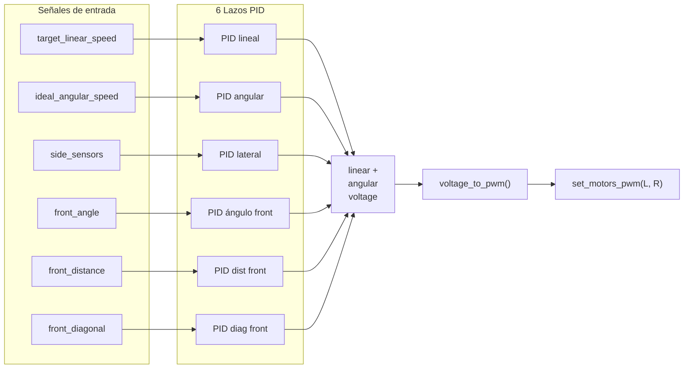
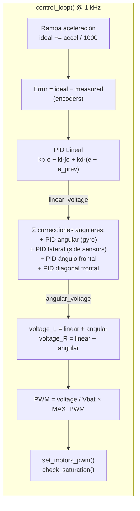

# Sistema de Control PID


## Arquitectura de Control

`control_loop()` en [`control.c:351-615`](../source_code/src/control.c#L351-L615) se ejecuta a **1 kHz** desde el SysTick ISR. Implementa 7 lazos PID en cascada para controlar velocidad lineal, velocidad angular y correcciones basadas en sensores.



---

## Lazos PID

### 1. PID Lineal (`KPI_LINEAR`)

```c
linear_error = ideal_linear_speed − measured_linear_speed
```

Controla la velocidad lineal del robot. `measured_linear_speed` es el promedio de la velocidad de ambas ruedas (encoders).

### 2. PID Angular (`KPI_ANGULAR`)

```c
angular_error = ideal_angular_speed − measured_angular_speed
```

Controla la velocidad angular. `measured_angular_speed = −lsm6dsr_get_gyro_z_radps()` (giroscopio, signo negado).

### 3. PID Lateral (`KPI_SIDE_SENSORS`)

```c
side_error = get_side_sensors_error()
```

Corrige el centrado entre paredes laterales. Ver [Sensores - Error Lateral](03-sensors.md#error-lateral-get_side_sensors_error).

### 4. PID Ángulo Frontal (`KPI_FRONT_ANGLE_SENSORS`)

```c
front_angle_error = get_front_sensors_angle_error()  // dist_L − dist_R
```

Corrige la orientación respecto a la pared frontal.

### 5. PID Distancia Frontal (`KPI_FRONT_DISTANCE_SENSORS`)

```c
front_distance_error = measured_front_dist − ideal_front_distance
```

Mantiene distancia constante a la pared frontal (usado en `keep_front_distance()`).

### 6. PID Distancia Frontal Raw (`KPI_FRONT_RAW_DISTANCE_SENSORS`)

Similar al anterior pero usando valores raw del ADC (modo `USE_RAW_SENSORS`).

### 7. PID Diagonal Frontal (`KPI_FRONT_DIAGONAL_SENSORS`)

```c
diagonal_error = get_front_sensors_diagonal_error()
```

Corrige la trayectoria en aproximaciones diagonales.

---

## Fórmula PID

Para cada lazo:

```
output = kp × error + ki × ∫error + kd × (error − last_error)
```

Donde:
- `∫error` es la suma acumulada del error (integrador)
- `(error − last_error)` es la derivada discreta

### Combinación de Voltajes

```c
linear_voltage  = PID_linear + PID_front_distance + PID_front_raw_distance
angular_voltage = PID_angular + PID_side + PID_front_angle + PID_front_diagonal

voltage_left  = linear_voltage + angular_voltage
voltage_right = linear_voltage − angular_voltage
```

### ⚠️ Anti-Windup

Los 6 integradores acumulan error sin clamping. Si los motores están saturados pero no alcanzan la velocidad deseada, el error se acumula. Al liberarse la condición, el overshoot puede desestabilizar el robot. Ver [MV-01](15-known-issues.md#mv-01).

---

## Compensación de Batería

```c
pwm = voltage / battery_voltage × MOTORES_MAX_PWM
```

Compensa variaciones de voltaje de batería para mantener el par motor constante. A menor batería, mayor PWM para la misma velocidad.

---

## Rampas de Aceleración

`update_ideal_linear_speed()` aplica aceleración progresiva hacia `target_linear_speed`:

```c
if (ideal < target) {
    accel = (ideal < speed_hard) ? accel_hard : accel_soft;
    ideal += accel / CONTROL_FREQUENCY_HZ;  // 1000
}
```

- **accel_hard**: aceleración inicial (más agresiva)
- **accel_soft**: aceleración tras superar `speed_hard` (más suave)
- **break_accel**: deceleración (frenada)

Las estrategias de velocidad más altas (FAST, SUPER, HAKI) usan aceleración en dos etapas para evitar deslizamiento.

---

## Detección de Saturación

### Saturación de PWM

```c
if (abs(pwm) >= MOTORES_SATURATION_PWM)   // 1000 de 1024
    saturation_count++;
else
    saturation_count = 0;
```

`MAX_MOTOR_SATURATION_COUNT = 100` → 100 ms de saturación continua → parada de emergencia.

### Saturación Angular

```c
if (abs(encoder_angular_speed) >= MOTORES_SATURATION_ANGULAR_SPEED)  // 50 rad/s
    angular_saturation_count++;
```

`MAX_MOTOR_ANGULAR_SATURATION_COUNT = 60` → 60 ms → parada de emergencia.

### Acción de Emergencia

1. Motores → 0
2. Ventilador → 0
3. LED RGB parpadea (rojo = PWM, azul = angular)
4. Si pasan 3 segundos → `set_race_started(false)`

---

## Control de Ventilador

El ventilador de succión también tiene control con rampa:

```c
update_fan_speed():
    if (ideal < target) ideal += fan_speed_accel / 1000
    set_fan_speed(ideal)
```

La velocidad del ventilador depende de la estrategia y del voltaje de batería (2S vs 3S).

---

## Diagrama de Cascada



---

*Documento generado el 2026-06-12. Ver también [Movimiento](04-movement.md), [Sensores](03-sensors.md), [Cinemática](14-kinematics.md). Issues: [MV-01, MV-10](15-known-issues.md).*
