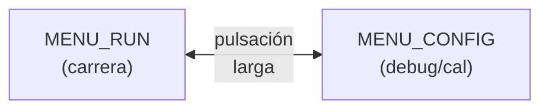

# Sistema de Menú


## Estructura General

El sistema de menú tiene dos niveles principales, alternados mediante **pulsación larga** del botón MODE:



Archivos: [`menu.c`](../source_code/src/menu.c), [`menu_run.c`](../source_code/src/menu_run.c), [`menu_configs.c`](../source_code/src/menu_configs.c).

### Controles

| Botón | Función |
|-------|---------|
| MODE (pulsación corta) | Cambiar modo dentro del menú actual |
| MODE (pulsación larga) | Alternar entre RUN y CONFIG |
| UP | Subir valor del modo actual |
| DOWN | Bajar valor del modo actual |
| START | Iniciar carrera (en MENU_RUN) |
| DEBUG | Activar debug (en MENU_CONFIG) |

---

## Menú RUN

7 modos de configuración para la carrera:

### 1. SPEED (Estrategia de Velocidad)

| Valor | Nombre | Velocidad máx | Aceleración |
|-------|--------|:------------:|:-----------:|
| 0 | `SPEED_EXPLORE` | 800 / 3500 mm/s | 8000 mm/s² |
| 1 | `SPEED_NORMAL` | 3000 mm/s | 12000 mm/s² |
| 2 | `SPEED_MEDIUM` | 5000 mm/s | 15000 mm/s² |
| 3 | `SPEED_FAST` | 5500 mm/s | 20000 mm/s² |
| 4 | `SPEED_SUPER` | 6000 mm/s | 25000 mm/s² |
| 5 | `SPEED_HAKI` | 6500 mm/s | 30000 mm/s² |

> Nota: SPEED_EXPLORE usa 800 mm/s en fase de exploración y 3500 mm/s en run.

### 2. RACE (Modo de Carrera)

| Valor | Nombre | Descripción |
|-------|--------|-------------|
| 0 | `EXPLORE_SIMPLE` | Ir a la meta explorando en el camino |
| 1 | `EXPLORE_HOME` | Llegar a la meta y volver al inicio |
| 2 | `EXPLORE_COMPLETE` | Explorar TODAS las celdas antes de volver |

### 3. EXPLORE_TYPE (Tipo de Floodfill)

| Valor | Nombre | Descripción |
|-------|--------|-------------|
| 0 | `FLOODFILL_TYPE_BASIC` | Coste 1.0 por celda (Manhattan) |
| 1 | `FLOODFILL_TYPE_DIAGONAL` | Coste 1.0 ortogonal / 0.7 diagonal |
| 2 | `FLOODFILL_TYPE_TIME` | Costes basados en tiempo real con cinemática |

### 4. MAZE_TYPE (Tipo de Laberinto)

| Valor | Nombre | Descripción |
|-------|--------|-------------|
| 0 | `MAZE_HOME` | Laberinto de pruebas local |
| 1 | `MAZE_COMPETITION` | Laberinto de competición |

### 5. SOLVE_STRATEGY (Estrategia de Resolución)

| Valor | Nombre | Descripción |
|-------|--------|-------------|
| 0 | `SOLVE_STANDARD` | Giros estándar (L→LEFT_90, LL→LEFT_180) |
| 1 | `SOLVE_DIAGONALS` | Optimización con diagonales compuestas |

### 6. EXPLORE_ALGORITHM (Algoritmo de Ejecución)

| Valor | Nombre | Descripción |
|-------|--------|-------------|
| 0 | `EXPLORE_HANDWALL` | Wall follower (mano derecha/izquierda) |
| 1 | `EXPLORE_TIME_TRIAL` | Carrera contrarreloj |
| 2 | `EXPLORE_FLOODFILL` | Floodfill con exploración y speed run |
| 3 | `EXPLORE_DRAGRACE` | Aceleración máxima en recta |

### 7. RESET_MAZE_ON_START

Controla si el maze se reinicia al comenzar una nueva exploración.

---

## Menú CONFIG

2 modos de configuración:

### 1. CALIBRATION (Calibración)

| Valor | Nombre | Función |
|-------|--------|---------|
| 0 | `CALIBRATE_NONE` | Sin calibración |
| 1 | `CALIBRATE_GYRO_Z` | Calibrar offset Z del giroscopio |
| 2 | `CALIBRATE_SIDE_SENSORS_OFFSET` | Calibrar offset de sensores laterales |
| 3 | `CALIBRATE_FRONT_SENSORS` | Calibrar sensores frontales |
| 4 | `CALIBRATE_FRONT_SENSORS_MIDDLE` | Calibrar distancia media frontal |
| 5 | `CALIBRATE_STORE_EEPROM` | Guardar calibraciones en EEPROM |

### 2. DEBUG (Modos de Visualización)

| Valor | Modo | Descripción |
|-------|------|-------------|
| 0 | `DEBUG_NONE` | Sin debug |
| 1 | `DEBUG_MACROARRAY` | Imprimir datos de macroarray |
| 2 | `DEBUG_TYPE_SENSORS` | Valores de sensores en vivo |
| 3 | `DEBUG_ENCODERS` | Milímetros de encoders |
| 4 | `DEBUG_GYRO` | Datos del giroscopio |
| 5 | `DEBUG_FLOODFILL_MAZE` | Imprimir maze con floodfill |
| 6 | `DEBUG_MOTORS_CURRENT` | Corriente de motores |
| 7 | `DEBUG_TIMETRIAL` | Demo de time trial |
| 8 | `DEBUG_KEEP_FRONT_DISTANCE` | Demo de control de distancia frontal |
| 9 | `DEBUG_GYRO_DEMO` | Demo de estabilización con giroscopio |
| 10 | `DEBUG_FAN_DEMO` | Demo de ventilador |

---

## Interacción

### Flujo en el Bucle Principal

```c
while (1) {
    if (!is_race_started()) {
        menu_handler();  // Navegación por menú

        // Activar sensores si el menú lo permite
        set_sensors_enabled(menu_run_can_start() || is_debug_enabled());

        if (menu_run_can_start()) {
            // Esperar detección de mano en sensores
            sensor_started = check_start_run();

            if (is_race_started()) {
                // Iniciar algoritmo seleccionado
                switch (menu_run_get_explore_algorithm()) {
                case EXPLORE_HANDWALL:
                    handwall_start();
                    break;
                case EXPLORE_FLOODFILL:
                    switch (sensor_started) {
                        case SENSOR_FRONT_LEFT_WALL_ID:
                        floodfill_start_run();
                        break;
                        case SENSOR_FRONT_RIGHT_WALL_ID:
                        floodfill_start_explore();
                        break;
                    }
                    break;
                case EXPLORE_TIME_TRIAL:
                    timetrial_start();
                    break;
                case EXPLORE_DRAGRACE:
                    dragrace_start();
                    break;
                }
            }
        }
    } else {
        // Carrera en curso
        switch (menu_run_get_explore_algorithm()) {
        case EXPLORE_HANDWALL:
            handwall_loop();
            break;
        case EXPLORE_FLOODFILL:
            floodfill_loop();
            break;
        case EXPLORE_TIME_TRIAL:
            timetrial_loop();
            break;
        }
    }
}
```

---

## Algoritmos de Ejecución

### HandWall (`EXPLORE_HANDWALL`)
- Wall follower clásico. Sigue la pared con mano izquierda o derecha.
- El sensor que se activa primero determina la mano a usar.
- Simple y robusto para laberintos sin islas.
- Archivos: [`handwall.c`](../source_code/src/handwall.c), [`handwall.h`](../source_code/include/handwall.h)

### FloodFill (`EXPLORE_FLOODFILL`)
- Navegación inteligente con floodfill.
- Fase 1: Exploración construyendo mapa de paredes.
- Fase 2: Speed run por el camino óptimo.
- Usa el tipo de floodfill, estrategia de solve y velocidad configurados.
- Archivos: [`floodfill.c`](../source_code/src/floodfill.c)

### Time Trial (`EXPLORE_TIME_TRIAL`)
- Speed run cronometrado en pista predefinida.
- Archivos: [`timetrial.c`](../source_code/src/timetrial.c), [`timetrial.h`](../source_code/include/timetrial.h)

### Drag Race (`EXPLORE_DRAGRACE`)
- Aceleración máxima en línea recta.
- Sin navegación, solo velocidad.
- Archivos: [`dragrace.c`](../source_code/src/dragrace.c), [`dragrace.h`](../source_code/include/dragrace.h)

---

## Control Remoto RC5

El menú puede controlarse remotamente mediante un receptor IR RC5 (38 kHz, TSSP77038TR):

```c
menu_rc5_mode_change()  → Cambiar modo
menu_rc5_up()           → Subir valor
menu_rc5_down()         → Bajar valor
```

Los códigos RC5 se almacenan en EEPROM (5 palabras).

---

*Documento generado el 2026-06-12. Ver también [Debug](08-debug-system.md), [Calibración](09-calibration.md), [Arquitectura Software](02-software-architecture.md).*
