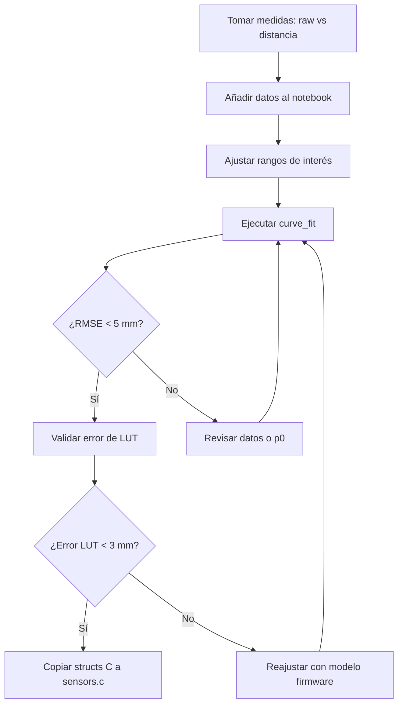

# Scripts: Calibración de Sensores IR

Herramienta offline para calibrar los sensores infrarrojos del robot. Calcula las
constantes `(a, b, c)` del modelo logarítmico empírico que convierte lecturas
ADC en distancia real (mm).

| Característica | Detalle |
|---------------|---------|
| **Script** | `scripts/sensors-profiles/sensors-profiles.ipynb` |
| **Tipo** | Jupyter Notebook |
| **Dependencias** | `numpy`, `pandas`, `matplotlib`, `scipy` |
| **Salida** | Constantes `(a, b, c)` para cada sensor → se copian a `sensors.c` |

---

## Modelo Matemático

### Ecuación

```
distance (m) = a / ln(raw + c) - b
```

| Parámetro | Descripción |
|-----------|-------------|
| `raw` | Valor ADC (0–4095), lectura diferencial: sensor ON − sensor OFF |
| `a` | Factor de escala — controla la forma de la curva logarítmica |
| `b` | Offset vertical — desplaza la curva en distancia |
| `c` | Offset horizontal — compensa el offset del sensor, evita colapso del logaritmo |

### Justificación física

Los sensores IR de reflectancia siguen aproximadamente la ley de la inversa del
cuadrado: `raw ∝ 1/d²`, o equivalentemente `d ∝ 1/√raw`. El modelo
`a/ln(raw+c) - b` es una aproximación empírica con asíntotas similares pero
mejor comportamiento en los extremos del rango.

### Conversión en el firmware

```c
// sensors.c:505-509
int16_t ln_index = (raw_filtered + calib.c) / 4;
float ln = get_ln_value(ln_index);
int16_t distance_mm = (int16_t)((calib.a / ln - calib.b) * 1000.0f);
```

El firmware usa una **LUT de 1024 entradas** que almacena `ln(index × 4)`. La
división entera por 4 introduce un error de cuantificación < 0.5% en distancia.
El notebook simula esta cuantificación y reporta el error introducido.

---

## Estructura del Notebook

| Celda | Contenido |
|-------|-----------|
| 0 | Imports: `numpy`, `pandas`, `matplotlib`, `scipy.optimize.curve_fit` |
| 1 | Datos de calibración: arrays de 26 valores raw por sensor, `ACTIVE_DATASETS`, `PLOT_MODE` |
| 2 | Grid 2×2 con valores raw de todos los robots superpuestos |
| 3 | Funciones: `raw_to_distance()`, `raw_to_distance_firmware()`, `estimate_p0()`, `compute_metrics()` |
| 4 | Selección de rangos de ajuste frontales y laterales |
| 5 | Ajuste de curvas con `curve_fit` (Levenberg-Marquardt), imprime `a,b,c ± incertidumbre` + R²/RMSE |
| 6 | Análisis de error: `.describe()`, RMSE por rangos, error de cuantificación LUT |
| 7 | Gráficas de error y curvas ajustadas |
| 8 | Structs C para copiar al firmware, agrupados por robot |

---

## Flujo de Trabajo



### Rangos de ajuste

| Sensor | Rangos de ajuste | Rango excluido |
|--------|-----------------|----------------|
| Frontales | 20–70 mm y 100–150 mm | 70–100 mm |
| Laterales | 5–90 mm y 100–170 mm | 90–100 mm |

Los rangos excluidos son distancias de transición donde la precisión es menos
crítica para la navegación.

### Ajuste de curvas

Se usa `scipy.optimize.curve_fit` con Levenberg-Marquardt. `estimate_p0()`
calcula valores iniciales a partir de los extremos del rango. Cada sensor se
ajusta independientemente con bounds específicos:

| Tipo | Bounds `a` | Bounds `b` | Bounds `c` |
|------|-----------|-----------|-----------|
| Frontales | [−10, 10] | [−1, 1] | [−200, 200] |
| Laterales | [−5, 5] | [−2, 2] | [−300, 300] |

---

## Integración con el Firmware

### Dónde se copian las constantes

[`source_code/src/sensors.c`](../source_code/src/sensors.c) — función
`set_sensors_robot_calibration()` (línea 67).

Las constantes se almacenan por versión de robot (`ZOROBOT3_A`, `ZOROBOT3_B`,
`ZOROBOT3_C`). La celda 8 del notebook imprime los structs C listos para copiar.

### Procesamiento en tiempo real

En [`update_sensors_magics()`](../source_code/src/sensors.c#L486), cada ciclo:

1. Cálculo de `raw_filtered` (mediana de 3 lecturas)
2. `ln_index = (raw_filtered + c) / 4`
3. Búsqueda en LUT: `ln = get_ln_value(ln_index)`
4. `distance_mm = (a / ln - b) × 1000`
5. Aplicación de offsets geométricos (`ROBOT_FRONT_LENGTH`, `ROBOT_MIDDLE_WIDTH`)
6. Filtro paso-bajo con α adaptativo (0.2 normal, 0.6 para cambios grandes)
7. Aplicación del offset de calibración de EEPROM (`sensors_distance_offset`)

---

## Guía de Uso

### Requisitos

```bash
pip install numpy pandas matplotlib scipy
```

### Procedimiento para un robot nuevo

1. **Tomar medidas**: colocar el robot a distancias conocidas (0–250 mm, pasos
   de 10 mm) y registrar el raw de cada sensor
2. **Añadir datos**: nueva entrada en `DATASETS` (celda 1) con arrays de 26
   valores (orden: 250 mm → 0 mm)
3. **Ajustar rangos** en celda 4 si es necesario
4. **Ejecutar `Cell > Run All`**
5. **Verificar**: RMSE < 5 mm en rangos ajustados, `a` no negativo, error LUT < 3 mm
6. **Copiar al firmware**: salida de la celda 8 → `set_sensors_robot_calibration()`

### Solución de problemas

| Síntoma | Causa probable | Solución |
|---------|---------------|----------|
| `a` negativo | Datos no siguen el modelo logarítmico | Revisar mediciones, verificar que `raw` decrece con la distancia |
| Error grande en rangos excluidos | Curva no extrapola bien | Ampliar rangos de ajuste en celda 4 |
| RMSE > 10 mm todos los sensores | Datos ruidosos o mal tomados | Repetir mediciones, verificar iluminación ambiental |
| LUT da resultados distintos | Error de cuantificación | Si > 3 mm, usar `raw_to_distance_firmware()` en `curve_fit` |

---

*Documento generado el 2026-08-25. Ver también [Sensores](03-sensors.md), [Calibración](09-calibration.md), [EEPROM](11-eeprom.md), [Problemas Conocidos](17-known-issues.md#sp-01).*
