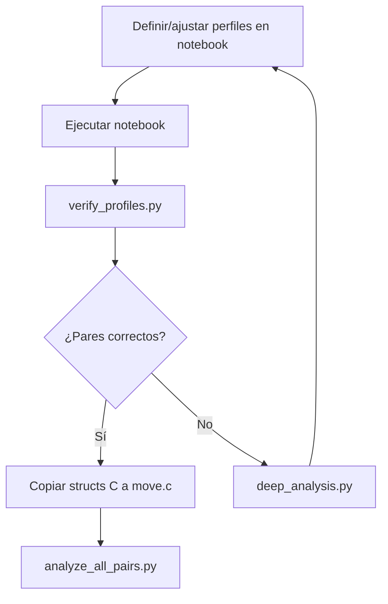

# Scripts: Perfiles de Giro

Sistema de generación de perfiles de giro con aceleración angular sinusoidal (jerk
limitado) para el robot micromouse. Produce trayectorias suaves que minimizan el
deslizamiento y el estrés mecánico.

| Característica | Detalle |
|---------------|---------|
| **Script principal** | `scripts/turn-profiles/turn-profiles.ipynb` |
| **Biblioteca** | `scripts/turn-profiles/micromouse_sinusoidal_turn_profiles_aux.py` (346 líneas) |
| **Scripts auxiliares** | `verify_profiles.py`, `deep_analysis.py`, `analyze_all_pairs.py`, `test_new_exit.py` |
| **Dependencias** | Python ≥ 3.10, NumPy, Pandas, Matplotlib, Jupyter |
| **Salida** | Structs C con parámetros de giro → se copian a `move.c` |

---

## Arquitectura

```
micromouse_sinusoidal_turn_profiles_aux.py
│
├── Maze               — dimensiones de celda (0.18m) y poste (0.012m)
├── RobotPhysics       — masa (0.070 kg), inercia, ancho (0.0702m), ω_max (40 rad/s)
├── Line               — recta definida por punto de referencia (x,y) y ángulo
├── TurnProfile        — perfil básico con DataFrame de trayectoria
├── SlalomTurnProfile  — perfil con líneas de entrada/salida + visualización
├── turn_profile()     — genera perfil de ω sinusoidal (3 fases)
├── complete_profile() — integra ω → posición, ángulo, fuerzas
├── complete_slalom_profile() — alinea con líneas de entrada/salida del laberinto
├── turn_shift()       — calcula desplazamiento para alinear perfil
└── Simulator          — orquesta la generación: slalom() e inplace()
```

---

## Sistema de Coordenadas

Las coordenadas se definen en **unidades de celda** relativas al poste (escaladas
por `maze.cell = 0.18m`):

```
                Norte (0, +0.5)
                    |
Oeste (-0.5, 0) ----+---- (+0.5, 0) Este
                    |
                Sur (0, -0.5)
```

- `(0, 0)` = centro del poste
- Ángulos: `0` = Este, `π/2` = Norte, `π` = Oeste, `3π/2` = Sur

---

## Perfil de Velocidad Angular

Cada giro tiene 3 fases con aceleración sinusoidal:

```
         ω_max  ───────────────
               ╱                ╲
             ╱                    ╲
    0  ─────                        ─────
    |--transition--|----arc----|--transition--|
```

| Fase | Ecuación |
|------|----------|
| Transición entrada | `ω(t) = ω_max · sin(t/transition · π/2)` |
| Arco constante | `ω(t) = ω_max` |
| Transición salida | `ω(t) = ω_max · cos(t/transition · π/2)` |

---

## Tipos de Giro

| Tipo | Ángulo | Entry | Exit | Radio (m) |
|------|--------|-------|------|-----------|
| **MOVE_90** | 90° | `(0, -.5, 0)` | `(.5, 0, π/2)` | 0.135 |
| **MOVE_180** | 180° | `(0, -.5, 0)` | `(0, .5, π)` | 0.090 |
| **MOVE_TO_45** | 45° | `(0, -.5, 0)` | `(.5, 0, π/4)` | 0.120 |
| **MOVE_TO_135** | 135° | `(0, -.5, 0)` | `(0, .5, 3π/4)` | 0.07456 |
| **MOVE_45_TO_45** | 90° | `(0, -.5, π/4)` | `(0, .5, 3π/4)` | 0.06364 |
| **MOVE_FROM_45** | 45° | `(0, -.5, π/4)` | `(.5, 0, π/2)` | 0.120 |
| **MOVE_FROM_45_180** | 135° | `(0, -.5, π/4)` | `(0, .5, π)` | 0.07456 |

---

## Estrategias de Velocidad

| Estrategia | v_90 | v_180 | v_TO_45 | v_TO_135 | v_45to45 | Uso |
|-----------|------|-------|---------|----------|----------|-----|
| EXPLORE | 0.800 | — | — | — | — | Exploración del laberinto |
| NORMAL | 1.696 | 1.350 | 1.644 | 1.118 | 0.955 | Carrera conservadora |
| MEDIUM | 1.932 | 1.575 | 1.865 | 1.305 | 1.114 | Carrera media |
| FAST | 2.220 | 1.800 | 2.146 | 1.491 | 1.273 | Competición |
| SUPER | 2.490 | 2.025 | 2.404 | 1.678 | 1.432 | Máxima segura |
| HAKI | 2.745 | 2.250 | 2.647 | 1.864 | 1.591 | Límite físico |

---

## Parámetros de Salida (Struct C)

```c
struct turn_params {
    float start;              // Distancia entrada (mm, con signo)
    float end;                // Distancia salida (mm, con signo)
    uint16_t linear_speed;    // Velocidad lineal (mm/s)
    float max_angular_speed;  // ω_max (rad/s)
    float transition;         // Duración transición (ms)
    float arc;                // Duración arco (ms)
    int8_t sign;              // +1 derecha, -1 izquierda
};
```

### Convención de signos de `.start` y `.end`

| Signo | `.start` | `.end` |
|-------|---------|--------|
| **Negativo** | El perfil empieza antes del sensing point (reduce el tramo recto previo) | El perfil termina después del sensing point (reduce el tramo recto posterior) |
| **Positivo** | El perfil empieza después del sensing point (alarga el tramo recto previo) | El perfil termina antes del sensing point (alarga el tramo recto posterior) |

---

## Scripts Auxiliares

| Script | Propósito |
|--------|-----------|
| `verify_profiles.py` | Verifica simetría de MOVE_180, correspondencia TO_135↔FROM_45_180, y TO_45↔FROM_45 |
| `deep_analysis.py` | Trazado paso a paso del proceso de generación de perfiles |
| `analyze_all_pairs.py` | Análisis de los 49 pares de giros posibles, gaps físicos, y distancias |
| `test_new_exit.py` | Evalúa el cambio de geometría de MOVE_180 (exit antiguo vs nuevo) |

---

## Flujo de Trabajo



---

## Problemas Conocidos

Ver [`17-known-issues.md`](17-known-issues.md) para los issues del subsistema de
movimiento (`MV-XX`). Issues específicos de los scripts:

| ID | Descripción | Estado |
|----|-------------|--------|
| — | MOVE_180: asimetría en `.start`/`.end` (exit antiguo en `(.5, 0, π)` causaba ratio 3.64×) | ✅ Corregido — exit cambiado a `(0, .5, π)` |
| — | TO_135 / FROM_45_180: referencia de salida incorrecta (`(.5, 0, 3π/4)` → `(0, .5, 3π/4)`) | ✅ Corregido |
| — | `turn_shift()` no funciona con líneas paralelas (afecta a giros de 180°) | ⚠️ Limitación de diseño — requiere shift manual |
| — | Error residual de ~2.55 mm en MOVE_180 por desplazamiento no exacto de 180 mm | ⚠️ Aceptable para la aplicación |

---

*Documento generado el 2026-06-25. Ver también [Movimiento](04-movement.md), [Cinemática](15-kinematics.md), [Control PID](06-control-system.md).*
