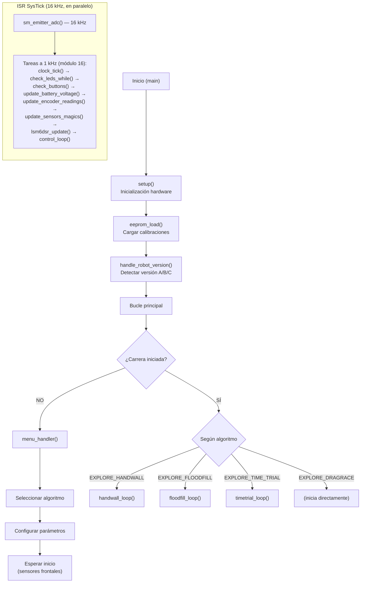

# Documentación Técnica de ZoroBot3

> Robot Micromouse de alto rendimiento con STM32F4, encoders magnéticos de alta resolución, ventilador de succión y 4 sensores infrarrojos.
>
> **Versión del documento**: 2026-06-12
> **Branch**: `develop`

---

## 🏆 Resultados en Competición

| 🥇 | 🥈 | 🥉 |
|:--:|:--:|:--:|
| **8** | **0** | **0** |

Competiciones ganadas: OSHWDem 2023-2025, RoboChallenge 2024-2025, Portuguese Contest 2025-2026.

---

## 📚 Índice de Documentación

Cada sección enlaza a un documento detallado independiente.

### 1. Hardware
- **[Hardware](01-hardware.md)** — Especificaciones del robot: MCU, sensores, motores, encoders, giroscopio, batería, chasis, PCB, versiones del robot (A/B/C).

### 2. Arquitectura Software
- **[Arquitectura Software](02-software-architecture.md)** — Bucle principal, SysTick ISR, distribución de tareas a 1 kHz, flujo de carrera, detección de inicio de competición, algoritmos de exploración.

### 3. Sensores
- **[Sistema de Sensores](03-sensors.md)** — Hardware IR (SFH-4550 + ST-1KL3A), máquina de estados ADC, linealización a distancia, detección de paredes con histéresis, calibración, cálculo de errores para control PID.

### 4. Movimiento
- **[Sistema de Movimiento](04-movement.md)** — Tipos de movimiento (26), perfiles de giro sinusoidales, movimientos rectos multi-celda, orquestración de speed run, wall loss correction.

### 5. Floodfill
- **[Algoritmo Floodfill](05-floodfill.md)** — Tipos (BASIC, DIAGONAL, TIME_BASED), cálculo de pesos cinemáticos, BFS con cola de prioridad, path following, exploración, speed run.

### 6. Control PID
- **[Sistema de Control PID](06-control-system.md)** — Arquitectura de 7 lazos PID en cascada, fórmula PID, anti-windup, compensación de batería, rampas de aceleración, detección de saturación.

### 7. Menú y Algoritmos de Ejecución
- **[Sistema de Menú](07-menu-system.md)** — Navegación por menú con botón, selección de algoritmo de exploración (HandWall, FloodFill, TimeTrial, DragRace), configuración de velocidad, opciones de debug.

### 8. Debug
- **[Sistema de Debug](08-debug-system.md)** — LEDs de información, LED RGB, puerto serie USART, funciones de debug, toma de valores raw.

### 9. Calibración
- **[Calibraciones](09-calibration.md)** — Calibración frontal, frontal media, lateral, calibración de giroscopio, persistencia en EEPROM.

### 10. EEPROM
- **[Gestión de EEPROM](11-eeprom.md)** — Diseño de almacenamiento, checksum (complemento a 2), carga/guardado de calibraciones, maze persistente, ocupación.

### 11. Encoders y Giroscopio
- **[Encoders y Giroscopio](12-encoders-gyro.md)** — AS5145B-HSST (12-bit), lectura por timer en cuadratura, max_likelihood_counter_diff, LSM6DSR (SPI, 1000-4000dps), filtro paso-bajo, integración angular.

### 12. Batería y LEDs
- **[Batería y LEDs](13-battery-leds.md)** — Monitorización de voltaje, divisor de tensión, LEDs de estado, LED RGB, control de ventilador.

### 13. Simulador
- **[Simulador MMSIM](14-simulator.md)** — Integración con Micromouse Simulator, API de paredes virtuales, estimación de tiempo.

### 14. Cinemática y Estrategias de Velocidad
- **[Cinemática](15-kinematics.md)** — Estrategias de velocidad (EXPLORE a HAKI), perfiles de aceleración, parámetros de giro, degradación de velocidad.

### 15. Problemas Conocidos
- **[Registro de Issues](17-known-issues.md)** — 47 issues documentados (10 críticos, 19 moderados, 18 leves) con IDs, descripciones, impacto y soluciones.

---

## 🔧 Stack Tecnológico

| Componente | Detalle |
|-----------|---------|
| **MCU** | STM32F405RGT6 @ 168 MHz (ARM Cortex-M4F) |
| **Framework** | LibOpenCM3 + PlatformIO |
| **Lenguaje** | C11 |
| **Compilador** | GCC ARM Embedded (arm-none-eabi-gcc) |
| **IDE** | VSCode |
| **Control de versiones** | Git (branch `develop`) |

---

## 📐 Dimensiones del Laberinto

| Parámetro | Valor |
|-----------|-------|
| Dimensión de celda | 180 mm |
| Diagonal de celda | 127.3 mm |
| Ancho de pared | 12 mm |
| Distancia centro a pared | 84 mm |
| Tamaño máximo | 16×16 celdas |
| Tamaño actual | 6×6 celdas |

---

## 🏗️ Estructura del Proyecto

```text
ZoroBot3/
├── docs/                    # 📚 Documentación (este directorio)
├── source_code/
│   ├── include/             # Headers (.h)
│   │   ├── config.h         # Configuración general, flags de compilación
│   │   ├── constants.h      # Constantes físicas y del sistema
│   │   ├── sensors.h        # API de sensores IR
│   │   ├── move.h           # API de movimiento + cinemática
│   │   ├── floodfill.h      # API de navegación
│   │   ├── control.h        # API de control PID
│   │   ├── menu.h           # API de menú
│   │   ├── calibrations.h   # API de calibración
│   │   ├── eeprom.h         # API de EEPROM
│   │   ├── encoders.h       # API de encoders
│   │   ├── lsm6dsr.h        # API de giroscopio
│   │   ├── leds.h           # API de LEDs
│   │   ├── battery.h        # API de batería
│   │   ├── motors.h         # API de motores
│   │   ├── utils.h          # Tabla de logaritmos
│   │   ├── handwall.h       # Algoritmo wall-follower
│   │   ├── timetrial.h      # Algoritmo time trial
│   │   ├── dragrace.h       # Algoritmo drag race
│   │   ├── debug.h          # Funciones de debug
│   │   ├── buttons.h        # Lectura de botones
│   │   ├── usart.h          # Puerto serie
│   │   ├── setup.h          # Inicialización hardware
│   │   ├── clock.h          # Timer del sistema
│   │   └── delay.h          # Delays
│   └── src/                 # Implementaciones (.c)
│       └── (archivos correspondientes a los headers)
├── pcb_files/               # Diseño PCB (KiCad)
├── images/                  # Imágenes del robot
├── BUGS.md                  # Registro de issues conocido
├── SENSORS.md               # Doc de sensores (legacy)
├── MOVEMENT.md              # Doc de movimiento (legacy)
├── FLOODFILL.md             # Doc de floodfill (legacy)
└── README.md                # README principal del proyecto
```

---

## ⚡ Frecuencias del Sistema

| Componente | Frecuencia | Detalle |
|-----------|-----------|---------|
| SYSCLK | 168 MHz | System clock |
| SysTick ISR | 16 kHz | Interrupción base |
| sm_emitter_adc() | 16 kHz | Máquina de estados ADC |
| clock_tick() | 1 kHz | Timer del sistema |
| update_sensors_magics() | 1 kHz | Procesamiento de sensores |
| update_encoder_readings() | 1 kHz | Lectura de encoders |
| lsm6dsr_update() | 1 kHz | Lectura de giroscopio |
| control_loop() | 1 kHz | Bucle de control PID |
| update_battery_voltage() | 1 kHz | Lectura de batería |
| check_buttons() | 1 kHz | Lectura de botones |
| check_leds_while() | 1 kHz | Actualización de LEDs |
| PWM motores | 20 kHz | Frecuencia de conmutación |

---

## 🔄 Flujo de Alto Nivel



---

## 📝 Notas sobre este Documento

- Los documentos legacy (`SENSORS.md`, `MOVEMENT.md`, `FLOODFILL.md`, `BUGS.md`) en la raíz del proyecto se mantienen como referencia histórica. Esta carpeta `docs/` contiene la versión actualizada y verificada.
- Las referencias a código fuente usan rutas relativas desde la raíz del proyecto (ej: [`source_code/src/sensors.c`](../source_code/src/sensors.c)).
- Los IDs de issues (FF-XX, SS-XX, MV-XX) se corresponden con el [registro de problemas conocidos](17-known-issues.md).

---

*Documento generado el 2026-06-12 para la versión `develop` del proyecto ZoroBot3.*
