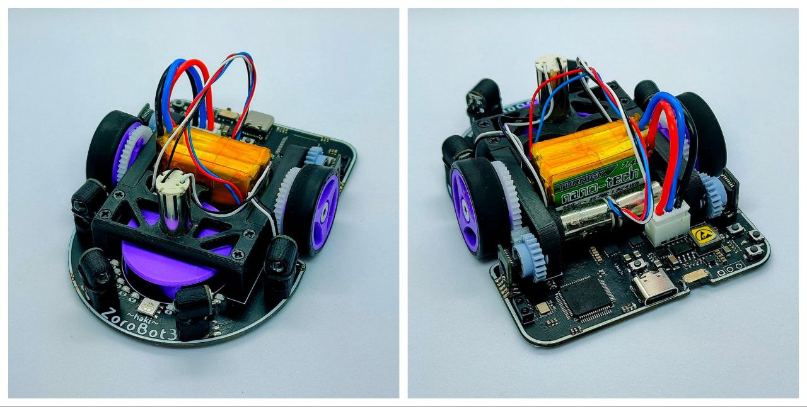
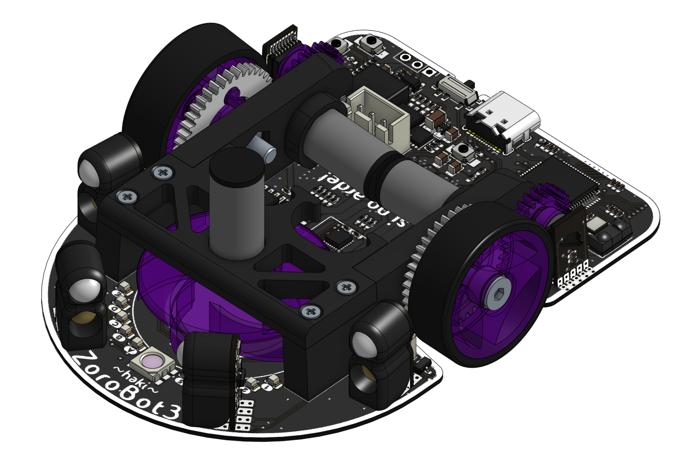

# ZoroBot3 — Documentación Técnica

> Robot micromouse de alto rendimiento con STM32F4, encoders magnéticos de alta resolución, ventilador de succión y 4 sensores infrarrojos.

---

## 🏆 Palmarés

| 🥇 | 🥈 | 🥉 |
|:--:|:--:|:--:|
| **8** | **0** | **0** |

### Resultados por Evento

| Evento | Categoría | Posición | Año |
|--------|-----------|:--------:|:---:|
|  **Micromouse Portuguese Contest** | Micromouse Classic | 🥇 | 2026 |
|  **RoboChallenge** | Maze | 🥇 | 2025 |
|  **OSHWDem** | Micromouse Classic | 🥇 | 2025 |
|  **Micromouse Portuguese Contest** | Micromouse Classic | 🥇 | 2025 |
|  **Micromouse Portuguese Contest** | Time Trial | 🥇 | 2025 |
|  **RoboChallenge** | Maze | 🥇 | 2024 |
|  **OSHWDem** | Micromouse Classic | 🥇 | 2024 |
|  **OSHWDem** | Micromouse Wall-Follower | 🥇 | 2023 |

---

## ⚙️ Hardware

- **Microcontrolador**: STM32F405RGT6 @168MHz
- **Driver de motores**: MP6551 @20kHz
- **Giroscopio**: LSM6DSRTR 4000dps
- **Encoders**: AS5145B-HSST (12-bit, lectura en cuadratura por hardware)
- **Regulador**: CN3903 + LDO ME611C33M5G
- **Sensores IR**: 4× SFH-4550 (emisores) + 4× ST-1KL3A (receptores) + TSSP77038TR (38kHz)
- **Batería**: LiPo 2S 260mAh 35-70C Turnigy nano-tech
- **Tracción**: 2× Motores Coreless 8520 7.4v, chasis de PCB, gomas Kyosho

---

## 💻 Software

- Programado en **C11** con VSCode, PlatformIO y **LibOpenCM3**.
- Valores analógicos leídos por **DMA**, procesados cada **1 ms**.
- Sensores IR gestionados por máquina de estados a **16 kHz** con filtrado de luz ambiente.
- Encoders en **cuadratura por hardware** mediante timers, MPU por **SPI**.
- **7 lazos PID en cascada** (velocidad lineal, angular, control frontal, control lateral) ejecutados cada 1 ms.
- Reseteo de posición por pérdida de pared lateral.
- Curvas con perfiles de giro de **aceleración senoidal**.
- Algoritmos: seguimiento de pared, exploración, **Floodfill basado en pesos cinemáticos** y movimientos hardcodeados.

---

## 📚 Documentación Detallada

- **[Hardware](01-hardware.md)** — MCU, sensores, motores, encoders, batería, chasis, versiones del robot
- **[Arquitectura Software](02-software-architecture.md)** — Bucle principal, SysTick ISR, flujo de carrera, exploración
- **[Sensores](03-sensors.md)** — Máquina de estados ADC, linealización, detección de paredes, histéresis
- **[Movimiento](04-movement.md)** — Tipos de movimiento, perfiles de giro, speed run, wall loss correction
- **[Floodfill](05-floodfill.md)** — Algoritmos BASIC/DIAGONAL/TIME_BASED, BFS, path following
- **[Control PID](06-control-system.md)** — 7 lazos en cascada, anti-windup, compensación de batería
- **[Menú](07-menu-system.md)** — Navegación, selección de algoritmo, configuración de velocidad
- **[Debug](08-debug-system.md)** — LEDs, RGB, USART, funciones de debug
- **[Calibración](09-calibration.md)** — Calibración frontal/lateral, giroscopio, persistencia en EEPROM
- **[Scripts: Calibración Sensores](10-scripts-sensors.md)** — Herramienta Jupyter de perfiles de linealización IR y magics
- **[EEPROM](11-eeprom.md)** — Almacenamiento, checksum, maze persistente
- **[Encoders y Giroscopio](12-encoders-gyro.md)** — AS5145B-HSST, LSM6DSR, integración angular
- **[Batería y LEDs](13-battery-leds.md)** — Monitorización de voltaje, divisor de tensión, LEDs de estado
- **[Simulador MMSIM](14-simulator.md)** — API de paredes virtuales, estimación de tiempo
- **[Cinemática](15-kinematics.md)** — Estrategias de velocidad, perfiles de aceleración, parámetros de giro
- **[Scripts: Perfiles de Giro](16-scripts-turn-profiles.md)** — Generación offline de perfiles de giro sinusoidales
- **[Problemas Conocidos](17-known-issues.md)** — Issues documentados con IDs, impacto y soluciones

---

## 🔧 Stack Tecnológico

| Componente | Detalle |
|-----------|---------|
| **MCU** | STM32F405RGT6 @ 168 MHz (ARM Cortex-M4F) |
| **Framework** | LibOpenCM3 + PlatformIO |
| **Lenguaje** | C11 |
| **Compilador** | GCC ARM Embedded (arm-none-eabi-gcc) |
| **IDE** | VSCode |
| **Control de versiones** | Git |

---

## 🎥 Vídeos

### Micromouse Portuguese Contest 2026 — 🥇
<video src="https://github.com/user-attachments/assets/5a7cf803-e31e-463a-afa9-e5784b378937" width="50%" controls></video>

### OSHWDem 2025 — 🥇
<video src="https://github.com/user-attachments/assets/332fd117-6600-4692-b59f-4b1154166f3f" width="50%" controls></video>

### Micromouse Portuguese Contest 2025 — 🥇
<video src="https://github.com/user-attachments/assets/cf21e942-3fe0-4065-8892-fa3d181a9791" width="50%" controls></video>

### RoboChallenge 2024 — 🥇
<video src="https://github.com/user-attachments/assets/a8c53e97-a756-4934-9c83-6c93fda1b235" width="50%" controls></video>

### OSHWDem 2024 — 🥇
<video src="https://github.com/user-attachments/assets/a70629e6-34b6-473f-afb0-14d8290bd128" width="50%" controls></video>
