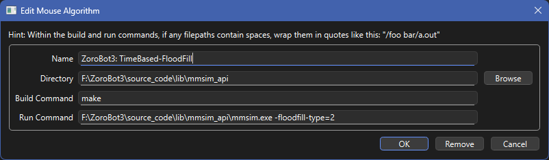

# MMSimulator API para ZoroBot3

Este directorio contiene la API de [MMSimulator](https://github.com/OPRobots/mms) para ZoroBot3, que permite la simulación y control del robot en un entorno virtual.

## Configuración de MMS
Para utilizar la API de [MMSimulator](https://github.com/OPRobots/mms) es necesario configurar el entorno de simulación. Asegúrate de seguir las instrucciones de instalación y configuración de su repositorio.

### Añadir API
Esta es la configuración de esta API:

  - **Name**: ZoroBot3: TimeBased-FloodFill.
  - **Directory**: La ruta en la que tengas el API. 
  
    Ej.: `F:\ZoroBot3\source_code\lib\mmsim_api`.
  - **Build command**: Se usa el comando `make` para compilar usando el fichero Makefile. (Es necesario tener instalado el componente *make* en tu sistema operativo).
  - **Run Command**: La ruta en la que tengas el compilado del API. Puedes especificar el tipo de FloodFill con el parámetro `-floodfill-type` segun la siguiente lista:
    - 0: Base-FloodFill
    - 1: DiagonalBased-FloodFill
    - 2: TimeBased-FloodFIll

    Ej.: `F:\ZoroBot3\source_code\lib\mmsim_api\mmsim.exe -floodfill-type=2`.